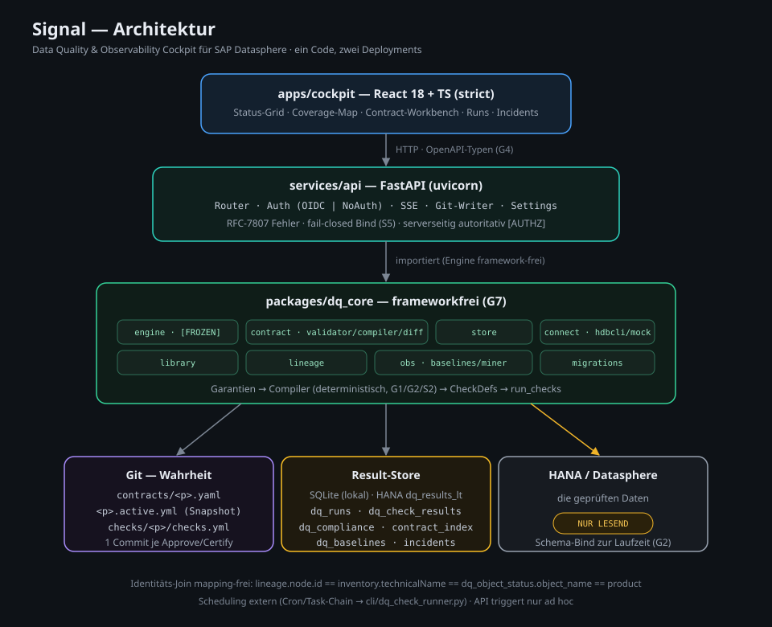

# Signal — Data Quality & Observability Cockpit

Binding **Data Contracts** and continuous **data-quality / observability monitoring** for **SAP Datasphere** — from a lightweight Lite entry point up to a governed Data Product.

From semantic guarantees (schema, keys, freshness, volume, completeness …) Signal deterministically compiles executable checks, runs them **read-only** against HANA/Datasphere, and surfaces the result as a **status cockpit, compliance traffic-light, and coverage map** — for platform teams **and** consumers.

> **No SQL in contracts.** Guarantees are purely semantic; the server validates them bindingly (gate G1). Raw rows never leave HANA without explicit opt-in (PII gate).



---

## At a glance

- **Data Contracts** as SQL-free YAML with guarantee families → compiler → checks.
- **`kind` separates Gate from Contract** (ADR-0001): "checks everywhere, contracts only at party boundaries." An `internal_gate` failure is an engineering signal, a `*_contract` failure is a governance-relevant breach. See [`docs/ADR-0001_Quality-Gates_vs_Contracts.md`](docs/ADR-0001_Quality-Gates_vs_Contracts.md).
- **Two operating modes** on one substrate: **Lite** (binding without versioning/approval ceremony) and **Full** (SemVer, approval, breaking-change protection) — orthogonal to `kind`, with the default following `kind`. See [`docs/Betriebsmodi_Lite_und_Full.md`](docs/Betriebsmodi_Lite_und_Full.md).
- **Cockpit** (React 18 + TS): DQ-first hero (health trend, family roll-ups, hotspots), status grid, lineage/coverage map, contract workbench, runs, incidents, proposals.
- **Compliance & SLA**: automatic `compliant`/`breached` transitions, SLA windows, incident timeline.
- **Observability**: rolling baselines + data-driven guarantee proposals (miner).
- **Dual deployment target** from the same code: consultant-local (SQLite, NoAuth) **and** customer (OIDC, HANA store, multi-worker).

---

## Quickstart (local)

Prerequisites: Python 3.11+, Node 18+.

```bash
# Backend + frontend dependencies
make install

# Seed demo data into the result store (optional)
SQLITE_DB=signal.db make seed

# Backend (FastAPI, http://127.0.0.1:8000 · API docs at /api/docs)
make dev-backend

# Frontend (Vite, http://localhost:5173)
make dev-frontend
```

In local mode the API runs fail-closed on `127.0.0.1` with NoAuth (a fixed admin principal). Without a configured environment, runs use a `MockConnection` (`ALLOW_MOCK_CONNECTION=true`).

### Tests

```bash
make test          # python -m pytest tests/ -v
cd apps/cockpit && npx vitest run && npx tsc --noEmit
```

---

## Repository layout

```
packages/dq_core/      # Framework-free engine (pip-installable)
  engine/              #   check execution, expectation grammar, dataclasses  [ENGINE-FROZEN]
  store/               #   Result-Store (SQLite/HANA) + numbered migrations
  connect/             #   HANA connection (hdbcli) + MockConnection
  contract/            #   model (kind), validator, compiler, diff, gate G3, compliance, seed, ODCS export
  validator/           #   shared validation building blocks
  library/             #   check library (sql_template catalog)
  lineage/             #   lineage / CSN analysis
  obs/                 #   baselines + proposal miner
  profile/             #   column profiling, PK candidates, sample rows  [PII-GATE]
services/api/          # FastAPI — routers, auth, settings, SSE, Git writer
apps/cockpit/          # Vite + React 18 + TS (strict) frontend
cli/                   # dq_check_runner.py — engine without the API (cron/task-chain)
contracts/             # Contract YAMLs (Git is the source of truth)
products/              # Data-product manifests (<name>.yaml — identity, owner, ports)
data/                  # inventory.json / lineage.json (extract snapshots)
docs/                  # concepts, plans, reviews, operating modes, tool reference
tests/                 # pytest (unit + api)
```

---

## Documentation

**Reference & operations** (what Signal is today)

| Document | Content |
|---|---|
| [`docs/Tooldokumentation.md`](docs/Tooldokumentation.md) | **Complete reference of the implemented state**: architecture, data model, API, configuration, security, deployment, development |
| [`docs/Betriebsmodi_Lite_und_Full.md`](docs/Betriebsmodi_Lite_und_Full.md) | Lite vs. Full — process, personas, tooling |
| [`docs/Konzept_DQ_Observability_Cockpit.md`](docs/Konzept_DQ_Observability_Cockpit.md) · [`docs/Konzept_DQ_Cockpit_UIUX.md`](docs/Konzept_DQ_Cockpit_UIUX.md) | Overall functional concept · UI/UX target picture |

**Architecture decisions (ADRs)**

| Document | Content |
|---|---|
| [`docs/ADR-0001_Quality-Gates_vs_Contracts.md`](docs/ADR-0001_Quality-Gates_vs_Contracts.md) | Separating internal quality gates from contracts via `kind` — **implemented** (batches 1–5) |
| [`docs/ADR-0002_Datasphere-DB-Zugriff.md`](docs/ADR-0002_Datasphere-DB-Zugriff.md) | DB identity: technical space user instead of Database Analysis User (read-only; amendment: writes only in Signal's own schema) |
| [`docs/ADR-0003_BDC-Datasphere-DataProductStudio.md`](docs/ADR-0003_BDC-Datasphere-DataProductStudio.md) | Signal in a BDC/Datasphere setup (HDLF spaces vs. SQL output port) |
| [`docs/ADR-0004_DataProduct-als-Komposition.md`](docs/ADR-0004_DataProduct-als-Komposition.md) | Data product as a composition over lineage — manifest + derived interior — implemented (phase 1) |
| [`docs/ADR-0005_Scheduling.md`](docs/ADR-0005_Scheduling.md) | External scheduling (task chain/cron) vs. internal (store-backed poller, option E) — implemented |
| [`docs/ADR-0006_Editor-Modus_aus_Kind.md`](docs/ADR-0006_Editor-Modus_aus_Kind.md) | Deriving editor mode (Lite/Full) from `kind` — implemented (batch 6); formerly "ADR-0002" |
| [`docs/ADR-0007_Generic-Operation-Progress-Channel.md`](docs/ADR-0007_Generic-Operation-Progress-Channel.md) | Generic operation/progress channel (DQ run vs. operation) — implemented; formerly "ADR-0005" |

The full index over **all** documents in `docs/` (incl. active/historical status) is in [`docs/README.md`](docs/README.md).

**Open items & status** (what's still outstanding)

| Document | Content |
|---|---|
| [`docs/OPEN_TASKS.md`](docs/OPEN_TASKS.md) | Consolidated backlog across all areas (incl. UI/UX status matrix) |
| [`docs/REVIEW_Tool_v2_Status.md`](docs/REVIEW_Tool_v2_Status.md) | Remediation status v2 + open backend items |

**Planning & review history** (how we got here — code/`Tooldokumentation.md` wins on conflict)

| Document | Content |
|---|---|
| [`docs/HANDOVER.md`](docs/HANDOVER.md) | Original implementation plan (workstreams, gates) |
| [`docs/PLAN_Remediation_v2.md`](docs/PLAN_Remediation_v2.md) | Remediation plan R0–R6 (implemented) |
| [`docs/REVIEW_Tool_v1_Befunde.md`](docs/REVIEW_Tool_v1_Befunde.md) · [`docs/REVIEW_Implementierungsplan.md`](docs/REVIEW_Implementierungsplan.md) | Critical tool/plan reviews (historical) |
| `docs/Implementation_Batch3…6_*.md` | Implementation batches for the `kind` discriminator (coverage/promotion, compliance/incident split, lifecycle ceremony, mode defaulting) |
| [`docs/Zusatz_ContractLifecycle_ORDBDCIntegration.md`](docs/Zusatz_ContractLifecycle_ORDBDCIntegration.md) · [`docs/Spec_Lineage_UX_Redesign.md`](docs/Spec_Lineage_UX_Redesign.md) | ORD/ODCS seam · lineage UX spec |

**Pitch & presentation**

| Document | Content |
|---|---|
| [`docs/Kundendeck_DataProducts_Lite.md`](docs/Kundendeck_DataProducts_Lite.md) | Presentation outline for the customer pitch |
| [`docs/Konzept_DQ_Observability_Cockpit.md`](docs/Konzept_DQ_Observability_Cockpit.md) | Overall functional concept |
| [`docs/ADR-0001_Quality-Gates_vs_Contracts.md`](docs/ADR-0001_Quality-Gates_vs_Contracts.md) | ADR: separating internal quality gates from contracts (implemented) |
| [`docs/ADR-0006_Editor-Modus_aus_Kind.md`](docs/ADR-0006_Editor-Modus_aus_Kind.md) | ADR: deriving editor mode (Lite/Full) from the artifact `kind` (accepted) |
| [`docs/ADR-0003_BDC-Datasphere-DataProductStudio.md`](docs/ADR-0003_BDC-Datasphere-DataProductStudio.md) | ADR: Signal in a BDC/Datasphere setup with Data Product Studio products (HDLF spaces vs. SQL output port) |
| [`docs/ADR-0004_DataProduct-als-Komposition.md`](docs/ADR-0004_DataProduct-als-Komposition.md) | ADR: data product as a composition over lineage — manifest + derived interior (proposal) |
| [`docs/Vortrag_Briefing_DataProducts_DataContracts_DSP_BDC.md`](docs/Vortrag_Briefing_DataProducts_DataContracts_DSP_BDC.md) | Briefing/handover for a talk on data products & data contracts in DSP/BDC |
| [`docs/Konzept_MultiPlattform_Executor_BDC.md`](docs/Konzept_MultiPlattform_Executor_BDC.md) | Concept: multi-platform executor (HANA · HDLF · SAP/native Databricks) via dialect/connector abstraction |
| [`docs/Scope_OpenLineage_Emitter.md`](docs/Scope_OpenLineage_Emitter.md) | Scope: OpenLineage emitter (lineage + DQ run results as standard events) + sales/POC value |
| [`docs/Zusatz_EntropyData_Integration_und_Defensibility.md`](docs/Zusatz_EntropyData_Integration_und_Defensibility.md) | Entropy Data: integration/differentiation as a marketplace + defensibility (HANA backend threat) |
| [`docs/Uebergabemodelle_und_Lizenz.md`](docs/Uebergabemodelle_und_Lizenz.md) | Handover models: service vs. software licensing (incl. managed-service variant A1) |
| [`docs/interactive/delivery-offering.html`](docs/interactive/delivery-offering.html) | **Interactive**: delivery offering "Data Contract & DQ Foundation for BDC" — phase plan, roles, operating models, pricing |
| [`docs/HANDOVER.md`](docs/HANDOVER.md) | Technical implementation plan (workstreams, gates) |

---

## Security guardrails (excerpt)

- **G1** no SQL in contracts · **G2** schema bound only at runtime · **G6** gating is never silently omitted · **G7** `dq_core` is framework-free · **G8** PII gate.
- HANA is accessed **read-only only**; checked data and results are kept separate.
- Auth is fail-closed: binding to `0.0.0.0` requires a real auth mode.

Full list and mechanics: [`docs/Tooldokumentation.md`](docs/Tooldokumentation.md) · [`docs/HANDOVER.md`](docs/HANDOVER.md).
