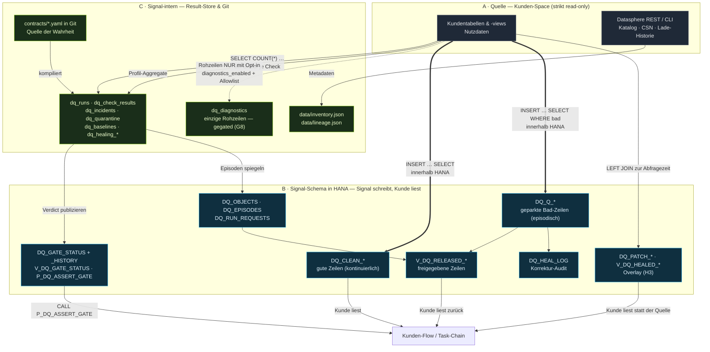
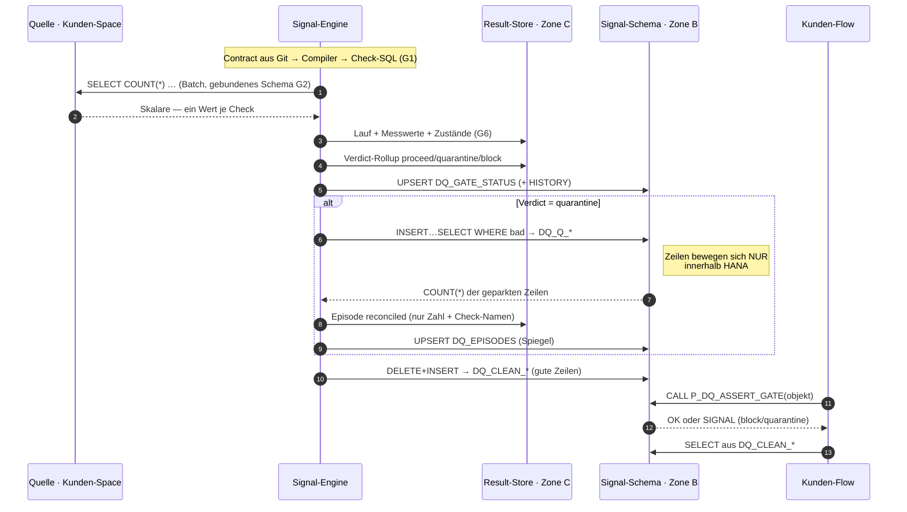
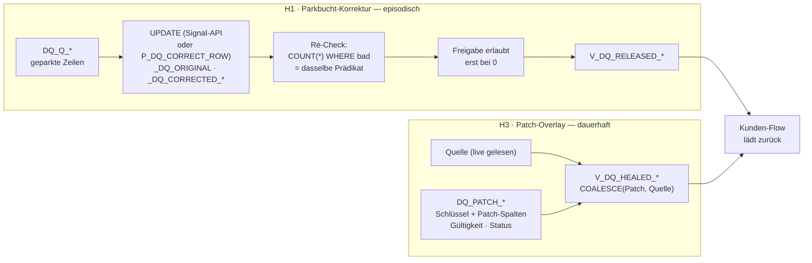
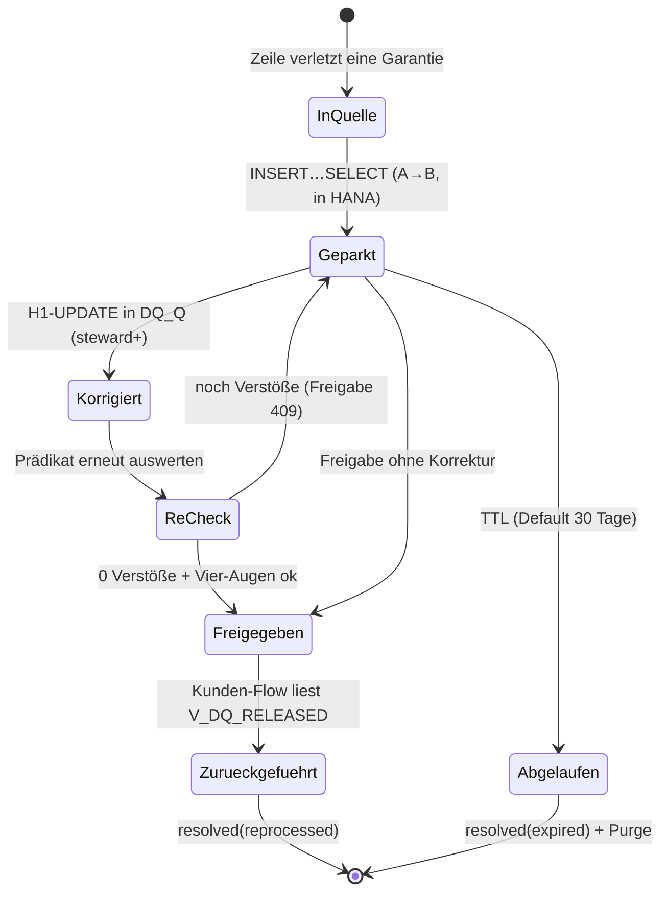

# Datenflüsse — was kommt aus der Quelle, was aus Signals eigenen Artefakten?

**Stand:** 2026-08-03 · **Zweck:** Eine Landkarte darüber, **welche Daten Signal
aus dem Kunden-Space liest**, **welche es in seinem eigenen Schema erzeugt** und
**wer was weiterverarbeitet** — allgemein und im Detail für Quarantäne, Release
und Healing.

**Leseregel:** Der Code gewinnt. Ergänzend gelten
[`ADR-0002`](ADR-0002_Datasphere-DB-Zugriff.md) (+ Amendment: Schreiben nur im
eigenen Schema), [`O10_Datenschutz_Review_Custody_Zone.md`](O10_Datenschutz_Review_Custody_Zone.md)
(Custody-Zone, TTL, Betroffenenrechte) und
[`Konzept_Datasphere_Integration_Gating_Quarantaene.md`](Konzept_Datasphere_Integration_Gating_Quarantaene.md).

---

## 0 / Die drei Zonen — in einem Satz

| Zone | Wer schreibt | Was liegt darin | Enthält Nutzdaten (Zeilen)? |
|---|---|---|---|
| **A · Quelle** (Kunden-Space, HANA/Datasphere) | **niemand aus Signal** — strikt lesend | Kundentabellen und -views | ja (fremd) |
| **B · Signal-Schema** (Open-SQL, eigenes Schema in derselben HANA) | ausschließlich Signals technischer Space-User | Verdicts, Registry, Episoden, CLEAN/Quarantäne-Zeilen, Patches, Views, Prozeduren | **ja** — nur `DQ_CLEAN_*`, `DQ_Q_*`, `DQ_PATCH_*` |
| **C · Signal-intern** (Result-Store + Git) | Signal | Läufe, Messwerte, Incidents, Episoden-Status, Baselines, Healing-Audit · Contracts in Git | **nein** — Zählwerte, Namen, Zeitstempel (eine gegatete Ausnahme, §3) |

Die entscheidende Grenze verläuft **nicht** zwischen „Quelle und Signal",
sondern zwischen **B und C**: Zeilen dürfen sich innerhalb HANA bewegen
(A → B, per `INSERT … SELECT`), verlassen die Datenbank in Richtung C aber nur
mit explizitem Opt-in.

---

## 1 / Gesamtbild

**Legende der Kantenstärke:** `==>` Zeilen bewegen sich (innerhalb HANA) ·
`-->` Aggregate/Metadaten · `-.->` nur mit ausdrücklichem Opt-in.

---

## 2 / Was Signal aus der Quelle liest

| Datenart | Woher / wie | Granularität | Landet in |
|---|---|---|---|
| Objekte, Spalten, Keys, CSN | Datasphere REST (`$expand=definition`) bzw. CLI | Metadaten | `data/inventory.json` |
| Lineage inkl. `columnEdges` | aus CSN/SQL abgeleitet (CQN-Walker, sqlglot) | Metadaten | `data/lineage.json` |
| Lade-/Run-Historie | Datasphere-API (`get_data_loads`) | Metadaten | Freshness, `mode=on_load`-Trigger |
| **Check-Messwerte** | kompiliertes Check-SQL, gebündelt als Batch | **ein Skalar je Check** (`COUNT(*)`, Ratio, Timestamp) | `dq_check_results.actual_value` |
| Profil-Statistiken | Profiling-SQL | Aggregate (NULL-%, Distinct, Min/Max) | `dq_profile_snapshots` |
| Schema-Ist-Zustand | Inventar-Extrakt | Spaltenliste + Typen | `dq_schema_snapshots` |
| **Diagnose-Rohzeilen** | `SELECT *  … LIMIT n` | **Zeilen** | `dq_diagnostics` — **nur** bei `diagnostics_enabled` je Check **und** Spalten-Allowlist (G8) |
| Profil-Beispielzeilen | Profiling | **Zeilen** | nur bei `ALLOW_PROFILE_SAMPLES=true` |
| Bad-/Good-Zeilen für Split | `INSERT … SELECT` **innerhalb HANA** | **Zeilen** | `DQ_Q_<OBJ>` / `DQ_CLEAN_<OBJ>` — verlassen die DB **nicht** |

> **Der Normalfall ist zahlenbasiert.** Ohne Opt-in sieht Signals Prozess von
> den Nutzdaten nur Zählwerte. Die beiden Zeilen-Pfade sind streng getrennt:
> Diagnostics **verlässt** HANA (deshalb doppelt gegated), der
> Quarantäne-Snapshot **bleibt** in HANA (deshalb TTL + Custody-Review statt
> App-seitiger Schutz).

---

## 3 / Was Signal in seinem eigenen Schema erzeugt (Zone B)

| Artefakt | Inhalt | Geschrieben von | Gelesen von |
|---|---|---|---|
| `DQ_GATE_STATUS` (+ `_HISTORY`) | Verdict je Objekt: `proceed \| quarantine \| block` | Signal nach jedem Lauf | `P_DQ_ASSERT_GATE`, `V_DQ_GATE_STATUS` |
| `V_DQ_GATE_STATUS` | stabile Lesesicht auf den Verdict | — (View) | Kunden-SQL, Monitoring |
| `P_DQ_ASSERT_GATE` | fail-closed Gate für Task-Chains | — (Prozedur) | Kunden-Task-Chain |
| `DQ_OBJECTS` | Registry der von Signal verwalteten Artefakte | Reconciler | Reconciler, Healing-Guard |
| `DQ_EPISODES` | Episoden-Status als HANA-Spiegel | Signal bei jedem Übergang | `V_DQ_RELEASED_<OBJ>` |
| `DQ_CLEAN_<OBJ>` | **gute Zeilen**, je Lauf neu befüllt | Signal (`DELETE` + `INSERT … SELECT`) | Kunden-Flow als Ersatzquelle |
| `DQ_Q_<OBJ>` | **geparkte Bad-Zeilen** + `_DQ_*`-Systemspalten | Signal (Snapshot, Healing-`UPDATE`) | Release-View, Re-Check, Healing |
| `V_DQ_RELEASED_<OBJ>` | nur Zeilen freigegebener Episoden | — (View) | Kunden-Flow zur Rückführung |
| `DQ_PATCH_<OBJ>` | Overlay-Zeilen (H3) | Signal (Patch-API) | `V_DQ_HEALED_<OBJ>` |
| `V_DQ_HEALED_<OBJ>` | **Quelle + Overlay** per `COALESCE` | — (View) | Kunden-Flow statt der Quelle |
| `DQ_HEAL_LOG` | Append-only-Audit jeder Korrektur | Signal-API + `P_DQ_CORRECT_ROW` | Audit/Governance |
| `DQ_RUN_REQUESTS` | Lauf-Anforderungen der SQL-Bridge | `P_DQ_REQUEST_RUN` | Signal-Poller |

**Signal schiebt nie.** Alle Rückwege zum Kunden sind **Pull**: der Kunden-Flow
liest `DQ_CLEAN_*`, `V_DQ_RELEASED_*` oder `V_DQ_HEALED_*` und schreibt selbst
in sein Ziel.

---

## 4 / Ablauf: Lauf, Verdict, Quarantäne

**Was hier aus der Quelle kommt:** ausschließlich Schritt 2 (Skalare) und die
`INSERT … SELECT`-Statements — deren Zeilen die Datenbank nie verlassen.
**Alles andere** — Verdict, Episode, Zählwerte, Gate-Entscheidung — stammt aus
Signals eigenen Artefakten.

---

## 5 / Ablauf: Healing (H1 Parkbucht, H3 Overlay)

Der wesentliche Unterschied in einer Zeile:

| | H1 Parkbucht | H3 Overlay |
|---|---|---|
| Gelesen/geschrieben wird | **nur** `DQ_Q_<OBJ>` (Zone B) | Patch in Zone B, **Quelle wird live mitgelesen** |
| Die Quelle wird angefasst | nein | nein (nur gelesen) |
| Überlebt einen Reload | **nein** (episodisch) | **ja** |
| Abnahme | Re-Check gegen das Bad-Prädikat | keine — der Patch gilt, bis er verfällt oder zurückgenommen wird |
| Rolle | steward+ | owner+ |

**`V_DQ_HEALED_<OBJ>` ist das einzige Artefakt, das Quelle und Signal-Daten zur
Abfragezeit zusammenführt** — überall sonst sind die Zonen sauber getrennt.
Ohne aktiven Patch liefert die View exakt die Quellzeile.

---

## 6 / Der Weg einer Bad-Zeile — end to end

Zustand und Entscheidung liegen im **Result-Store** (Zone C), die Zeile selbst
in **Zone B**. Das Cockpit zeigt durchgehend nur Zone C — Zahlen, Namen,
Zeitstempel, Akteure.

---

## 7 / Die drei harten Grenzen

1. **Kein Schreiben in der Quelle.** Kein Statement in `dq_core/enforce/*`
   adressiert schreibend eine Kundentabelle; alle generierten DDL/DML tragen
   `{signal_schema}` als Ziel (G2, gebunden zur Laufzeit).
2. **Rohzeilen verlassen HANA nur mit Opt-in** (G8). Der Quarantäne-Snapshot
   ist deshalb *kein* Bruch dieser Regel — er bewegt Zeilen innerhalb der
   Datenbank. Der einzige Ausleitungspfad ist `dq_diagnostics`, doppelt
   gegated.
3. **Rückführung ist Pull, nie Push.** Signal stellt Views bereit; ob und wann
   der Kunden-Flow sie liest, entscheidet der Kunde.

---

## 8 / Querverweise

- [`O10_Datenschutz_Review_Custody_Zone.md`](O10_Datenschutz_Review_Custody_Zone.md) — Custody-Zone, TTL, Betroffenenrechte, Auflagen-Checkliste
- [`Konzept_Datasphere_Integration_Gating_Quarantaene.md`](Konzept_Datasphere_Integration_Gating_Quarantaene.md) — Slices ③–⑦, Split-Varianten
- [`Konzept_Manuelles_Healing.md`](Konzept_Manuelles_Healing.md) — **maßgebliche Healing-Referenz**: Optionen H1–H5, Umsetzungsstand, Abweichungen, Mechanik-Bauplan
- [`Konzept_Quarantaene_Healing.md`](Konzept_Quarantaene_Healing.md) — Proposal 2026-07, **historisch** (darin aufgegangen)
- [`ADR-0002_Datasphere-DB-Zugriff.md`](ADR-0002_Datasphere-DB-Zugriff.md) — DB-Identität + Schreib-Amendment
- Interaktiv: [`interactive/enforcement-logik-landkarte.html`](interactive/enforcement-logik-landkarte.html) · [`interactive/enforcement-gating-quarantaene.html`](interactive/enforcement-gating-quarantaene.html)
